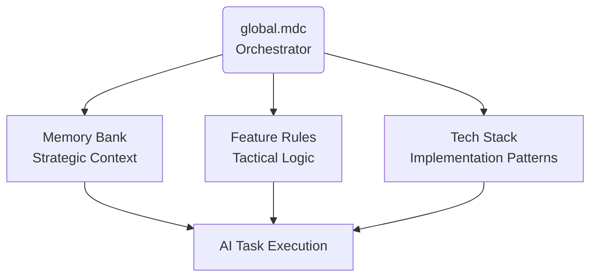

# Cursor Rules System 

The Cursor Rules System is a structured framework for managing AI context within the Cursor IDE, engineered for developing production-ready applications. It provides a persistent, hierarchical knowledge base for a repository to address critical challenges in long-term context management, architectural consistency, and team collaboration. 

The system's primary function is to solve context loss between development sessions. By establishing a canonical source of truth for project history and standards, it ensures the AI assistant operates with a deep understanding of the codebase. A key innovation is the "Feature Rule" concept, which allows developers to plan and document functionality on a feature-by-feature basis, creating executable blueprints for the AI to follow. This approach is a direct response to the challenges of maintaining AI context at scale, adapting and refining open-source concepts for a demanding, production-focused environment.

This architecture was developed and validated during the construction of a complex, AI-native social media application. Its design is the direct result of overcoming the practical challenges of maintaining AI context at scale, adapting and refining open-source concepts for a demanding, production-focused environment.

## 🚀 Quick Start

**Add to Project:** Copy the `.cursor/` directory to your project root.

```
your-project/
├── .cursor/
│   ├── global.mdc
│   ├── memory-bank/
│   ├── feature-rules/
│   └── tech-stack/
└── ... (your other project files)
```

**Customize:** Review and edit the Markdown (.md) files in `memory-bank/` to reflect your project's goals and architecture.

**Plan a Feature:** Use the custom `/plan` command (defined within the rules). This command helps you think through a task, generating a detailed feature rule file with implementation steps.

**Execute:** Ask the Cursor agent to implement the new feature rule file. The AI will now have full, structured context to execute the task precisely.

**Evolve:** Update the context files as your project evolves to keep the AI's knowledge current.

## 🏗️ System Architecture

This system uses a hierarchical model orchestrated by a central file, `global.mdc`, which acts as the "operating system" for the AI's context. It defines how all other rule files are loaded, prioritized, and interact.



### 🎛️ Global Orchestration (`global.mdc`)
**The Conductor.** This file is the heart of the system. It defines the loading order, manages the workflow between domains, and contains the core logic for custom commands like `/plan`. It establishes the protocols for how the AI should think, plan, and document its work.

### 🧠 Memory Bank (`memory-bank/`)
**The Strategic Layer.** This is the long-term project intelligence. It holds the "unforgettable" context.

- Project scope, core purpose, and user personas
- High-level system architecture and data models
- Key technical decisions and engineering philosophies

### 🎯 Feature Rules (`feature-rules/`)
**The Tactical Layer.** This contains reusable logic for specific, user-facing features. These rules are often generated by the `/plan` command.

- `auth.md`: Logic for authentication, registration, and session management.
- `social-feed.md`: Rules for generating and displaying content feeds.
- `notifications.md`: Patterns for user notification systems.

### 🔧 Tech Stack (`tech-stack/`)
**The Implementation Layer.** This layer constrains the AI to your specific technology choices and best practices.

- Framework-specific patterns (e.g., FastAPI dependency injection)
- Code style, linting rules, and quality standards
- Configuration for tools and external services

## 📖 Key Features

**Long-Term Memory:** Solves context window limitations and session resets, creating a persistent project "brain."

**Team-Wide Consistency:** Ensures every developer's AI assistant operates with the same architectural rules and context.

**Custom Command Engine:** Define your own commands (like `/plan`) within the rule files to standardize complex workflows.

**Hierarchical Context:** A three-tier architecture prevents rule conflicts and allows for granular control over AI behavior.

**Extensible Tool Integration:** Easily integrate and provide context for external tools. For example, we used the Supabase MCP to grant the AI direct access to read database schemas and modify data, drastically improving development efficiency.

## 🎯 Use Cases

This system is designed for professional development teams building robust applications:

- **Large & Complex Projects:** Maintain sanity and context across long development cycles.
- **Team Collaboration:** Onboard new developers faster and ensure consistent AI behavior for the whole team.
- **Enforcing Architecture:** Document and programmatically enforce critical architectural patterns.
- **AI-Native Development:** Building applications where AI is a core part of the development process, not just an occasional assistant.

## 📚 Documentation

- [Complete Setup Guide](docs/setup-guide.md) - Installation and configuration
- [Workflow Guide](docs/workflow-guide.md) - How to use the system effectively
- [Architecture Guide](docs/architecture-guide.md) - Deep dive into system design
- [Examples](examples/) - Templates and starter configurations
- [Contributing Guide](CONTRIBUTING.md) - How to contribute to this project

## 🤝 Contributing

We welcome contributions! This system was born from real-world needs, and we believe community input can make it even better. Please see our [Contributing Guide](CONTRIBUTING.md) for details.

## 📄 License

MIT License - see [LICENSE](LICENSE) file for details.