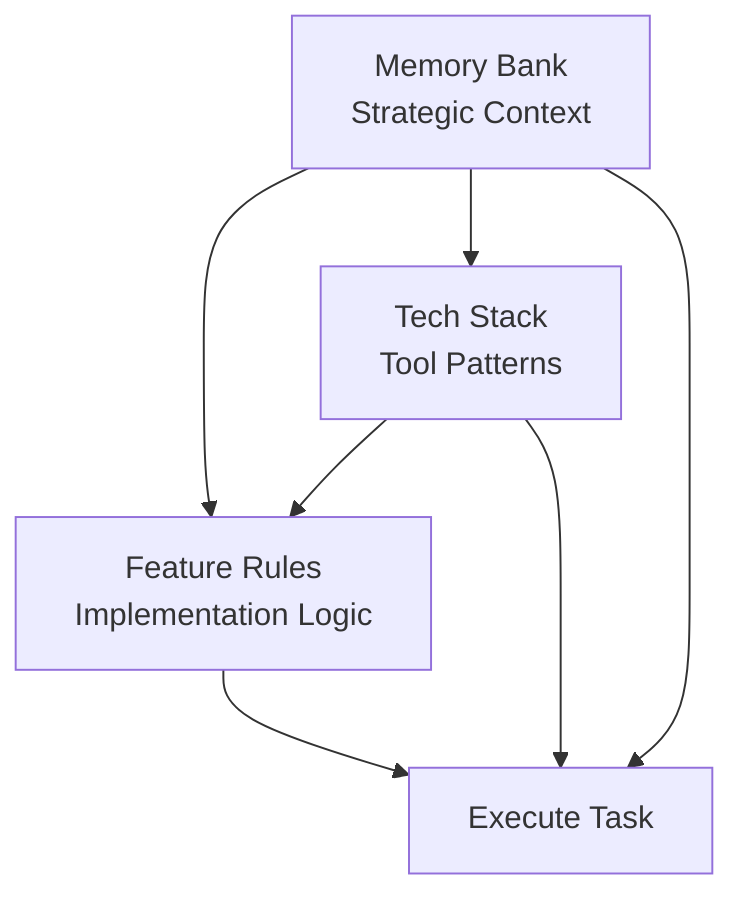

# Cursor Rules System

A comprehensive, hierarchical rule system for AI-assisted development with Cursor IDE. This system provides structured context management, feature-specific guidance, and technology patterns to enhance AI collaboration in software projects.

## 🚀 Quick Start

1. Copy the `.cursor/` directory to your project root
2. Review and customize the memory bank files for your project
3. Start with `/plan` mode to see the system in action
4. Update contexts as your project evolves

## 📋 System Overview

This system consists of three interconnected rule domains that work together to provide comprehensive AI assistance:

### 🧠 Memory Bank (`memory-bank/`)
**Strategic Layer** - Long-term project intelligence and context
- Project scope and goals
- Current work focus and progress
- System architecture patterns
- Technical context and decisions

### 🎯 Feature Rules (`feature-rules/`)
**Feature Layer** - Reusable logic for specific user-facing features
- Authentication systems
- AI integration patterns
- Social interaction features
- Content management systems

### 🔧 Tech Stack (`tech-stack/`)
**Implementation Layer** - Technology-specific patterns and constraints
- Framework-specific best practices
- Code quality standards
- Tool configuration patterns

## 🏗️ Architecture

The system follows a hierarchical execution model:

1. **Context Loading**: Read memory bank core files
2. **Feature Identification**: Load relevant feature rules
3. **Technology Selection**: Apply tech stack patterns
4. **Execution**: Implement with full context
5. **Documentation**: Update relevant files

## 📖 Key Features

- **Memory Reset Resilience**: Designed for AI systems that reset between sessions
- **Hierarchical Rule System**: Three-tier architecture prevents conflicts
- **Cross-Domain Integration**: Rules reference and build upon each other
- **Status Tracking**: Text-based status system for clear progress tracking
- **MCP Integration**: Supports Model Context Protocol for enhanced tool access

## 🎯 Use Cases

- **Large Projects**: Maintain context across long development cycles
- **Team Collaboration**: Consistent AI behavior across team members
- **Complex Architectures**: Document and enforce architectural patterns
- **Feature Development**: Reusable patterns for common features
- **Knowledge Preservation**: Capture and maintain project intelligence

## 📚 Documentation

- [Complete Setup Guide](docs/setup-guide.md) - Installation and configuration
- [Workflow Guide](docs/workflow-guide.md) - How to use the system effectively
- [Architecture Guide](docs/architecture-guide.md) - Deep dive into system design
- [Examples](examples/) - Templates and starter configurations
- [Contributing Guide](CONTRIBUTING.md) - How to contribute to this project

## 🤝 Contributing

We welcome contributions! Please see our [Contributing Guide](CONTRIBUTING.md) for details on:
- How to submit improvements
- Code standards and practices
- Documentation requirements
- Testing guidelines

## 📄 License

MIT License - see [LICENSE](LICENSE) file for details.

## 🙏 Acknowledgments

This system was developed through practical experience building complex AI-assisted applications and represents lessons learned from managing large-scale development projects with AI collaboration.

---

**Ready to enhance your AI development workflow?** Start with the [Setup Guide](docs/setup-guide.md) and transform how you work with AI assistants.