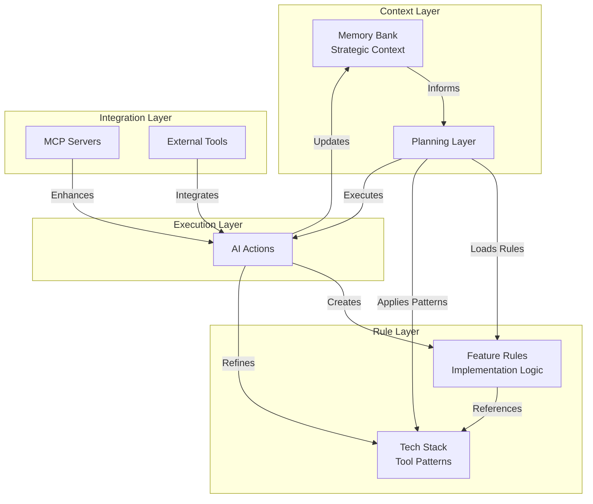
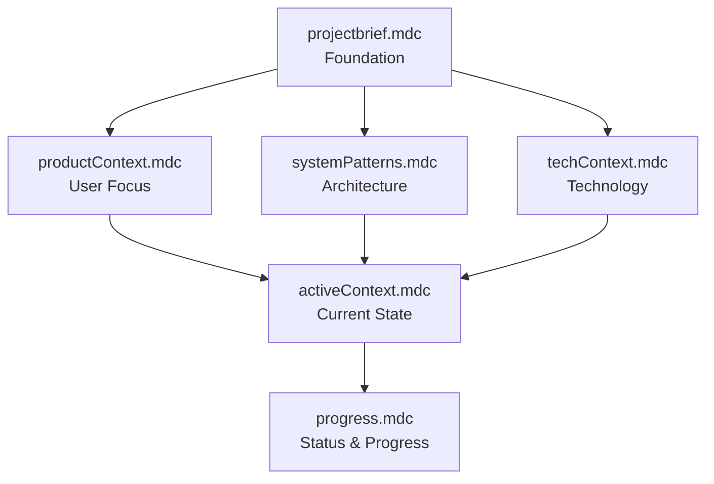
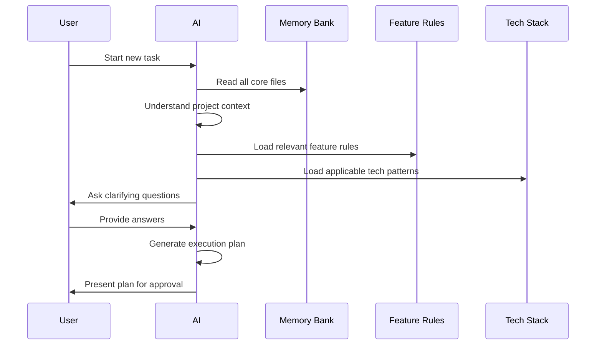
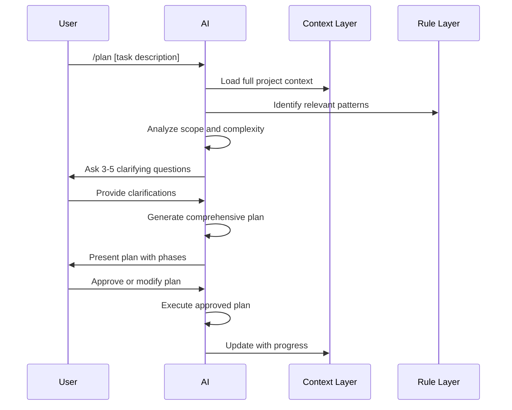
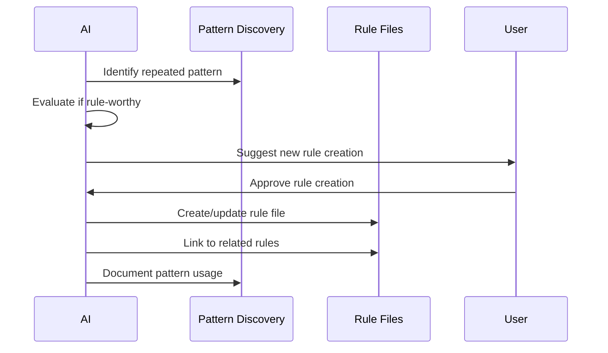
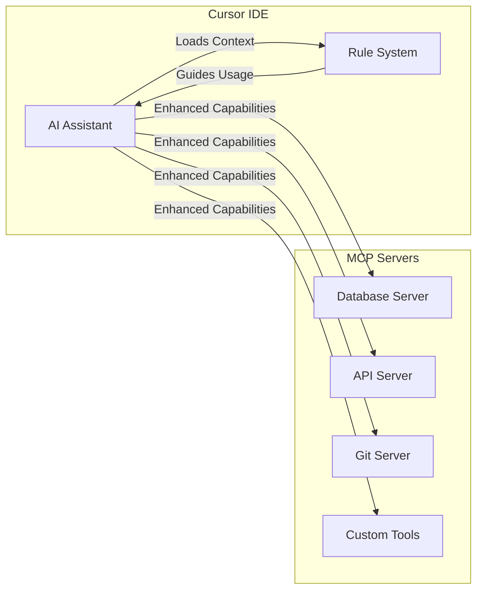

# Architecture Guide

This guide provides a deep dive into the design principles, structure, and philosophy behind the Cursor Rules System.

## System Philosophy

### Core Principles

1. **Memory Reset Resilience**
   - Designed for AI systems that reset between sessions
   - Complete context must be readable from files
   - No dependency on previous conversation history

2. **Hierarchical Context**
   - Three-tier rule system prevents conflicts
   - Clear dependencies between rule domains
   - Logical information flow from strategic to tactical

3. **Living Documentation**
   - Rules evolve with the project
   - AI learns and documents patterns
   - Documentation drives behavior, not just describes it

4. **Collaborative Intelligence**
   - Human provides strategic direction
   - AI handles tactical implementation
   - System captures and preserves institutional knowledge

## Architecture Overview

## Rule Domain Design

### Memory Bank (Strategic Layer)

**Purpose**: Maintains long-term project intelligence and context

**Design Decisions**:
- **Six core files**: Ensures complete context coverage
- **Hierarchical dependencies**: Files build upon each other logically
- **Text-based status**: Consistent, scannable progress tracking
- **No code storage**: Architectural patterns, not implementation details

**File Hierarchy**:

### Feature Rules (Implementation Layer)

**Purpose**: Captures reusable logic for specific user-facing features

**Design Decisions**:
- **Atomic functionality**: One rule per distinct feature capability
- **Implementation agnostic**: Describes what, not how
- **Pattern documentation**: Templates for common feature types
- **Cross-feature linking**: Rules reference related patterns

**Organization Strategy**:
- Group by user-facing functionality
- Focus on business logic patterns
- Include error handling and edge cases
- Document integration points

### Tech Stack (Tool Layer)

**Purpose**: Provides technology-specific implementation guidance

**Design Decisions**:
- **Tool-specific patterns**: How to implement with specific technologies
- **Code quality standards**: Consistent implementation practices
- **Integration patterns**: How tools work together
- **Best practices**: Established patterns for each technology

**Coverage Areas**:
- Framework-specific patterns
- Database design patterns
- API design standards
- Testing strategies
- Deployment practices

## Information Flow Design

### Session Startup Flow

### Planning Mode Flow

### Rule Update Flow

## Status Tracking System

### Design Rationale
- **Text-only indicators**: Universal readability across systems
- **Hierarchical categories**: Progress, content type, phase indicators
- **Scannable format**: Quick status identification
- **Consistent usage**: Same system across all documentation

### Status Categories

**Progress Status**:
- Tracks completion state of tasks/features
- Enables quick project health assessment
- Supports dependency management

**Content Types**:
- Categorizes information by purpose
- Aids in context-appropriate updates
- Supports focused reviews

**Phase Indicators**:
- Tracks development lifecycle stages
- Coordinates team activities
- Manages workflow transitions

## Integration Architecture

### MCP (Model Context Protocol) Integration

**Benefits**:
- Enhanced AI capabilities through tool access
- Consistent tool usage patterns
- Context-aware tool selection
- Automated workflow integration

### External Tool Integration
- **Version Control**: Git operations guided by rules
- **Database**: Schema changes following patterns
- **APIs**: Integration patterns and error handling
- **Deployment**: Consistent deployment practices

## Scalability Considerations

### Project Size Scaling
- **Small Projects**: Core memory bank + minimal rules
- **Medium Projects**: Full rule system with feature specialization
- **Large Projects**: Extensive rule hierarchy with team coordination
- **Enterprise**: Multiple rule systems with shared patterns

### Team Size Scaling
- **Solo Developer**: Personal context and pattern documentation
- **Small Team**: Shared rule system with individual contexts
- **Large Team**: Role-based rules with team coordination patterns
- **Organization**: Standardized rule templates across projects

### Complexity Scaling
- **Simple Applications**: Basic feature and tech rules
- **Complex Systems**: Comprehensive architectural patterns
- **Distributed Systems**: Cross-system integration rules
- **Legacy Systems**: Migration and modernization patterns

## Performance Considerations

### Context Loading Optimization
- **Lazy Loading**: Load rules on demand
- **Caching**: Cache frequently accessed patterns
- **Incremental Updates**: Update only changed contexts
- **Parallel Processing**: Load multiple contexts simultaneously

### Rule Processing Efficiency
- **Rule Indexing**: Quick rule discovery and loading
- **Conflict Detection**: Automated rule conflict identification
- **Pattern Matching**: Efficient pattern recognition
- **Update Batching**: Batch rule updates for efficiency

## Quality Assurance

### Rule Quality Metrics
- **Consistency**: Rules follow established patterns
- **Completeness**: All necessary contexts are covered
- **Accuracy**: Rules reflect actual project state
- **Relevance**: Rules are actively used and useful

### Validation Strategies
- **Cross-Reference Checking**: Ensure rule consistency
- **Usage Tracking**: Identify unused or outdated rules
- **Feedback Loops**: Continuous rule improvement
- **Automated Testing**: Validate rule effectiveness

## Future Evolution

### Planned Enhancements
- **Rule Templates**: Pre-built rule sets for common scenarios
- **Pattern Mining**: Automated pattern discovery from codebases
- **Team Collaboration**: Enhanced multi-developer workflows
- **IDE Integration**: Deeper integration with development tools

### Extensibility Points
- **Custom Status Systems**: Domain-specific status indicators
- **Rule Validators**: Custom rule validation logic
- **Integration Adapters**: Support for additional tools and services
- **Template Engines**: Dynamic rule generation from templates

---

This architecture is designed to evolve with your needs while maintaining consistency and effectiveness in AI-assisted development workflows.