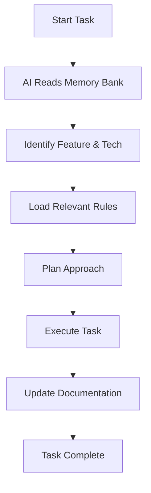

# Workflow Guide

Learn how to effectively use the Cursor Rules System for enhanced AI-assisted development. This guide covers daily workflows, best practices, and advanced usage patterns.

## Core Workflow Pattern

Every interaction with the AI should follow this pattern:



## Essential Commands

### `/plan` - Strategic Planning Mode

Use when starting significant work or when you need a comprehensive approach:

```
/plan implement user authentication system
```

**What happens:**
1. AI reads all memory bank files
2. Identifies relevant feature rules (authentication-system.mdc)
3. Loads applicable tech stack patterns
4. Asks 3-5 clarifying questions
5. Creates detailed implementation plan
6. Requests approval before proceeding

### `update memory bank` - Context Refresh

Triggers comprehensive memory bank review and updates:

```
update memory bank
```

**When to use:**
- After completing major features
- When starting new development phases
- When project direction changes
- Before beginning complex tasks

### `/write-rules` - Pattern Documentation

Formalizes repeated logic into reusable rules:

```
/write-rules the pattern we just used for API error handling
```

## Daily Development Workflows

### 🌅 Starting a Development Session

1. **Open Cursor** in your project
2. **Let AI load context** - The system automatically reads memory bank files
3. **Review active context** - Check `activeContext.mdc` for current focus
4. **Use `/plan`** for any significant new work

```
Good: /plan add social sharing features to posts
Avoid: Just jumping into coding without context loading
```

### 🔄 During Development

1. **Follow feature rules** - AI references relevant `feature-rules/*.mdc` files
2. **Apply tech patterns** - System uses `tech-stack/*.mdc` for implementation
3. **Document discoveries** - Note new patterns for future rule creation
4. **Update progress** - Keep `progress.mdc` current

### 🌙 Ending a Session

1. **Update active context** - Document what was accomplished
2. **Log next steps** - Update `activeContext.mdc` with immediate next actions
3. **Document patterns** - Use `/write-rules` for any reusable logic discovered
4. **Update progress** - Mark completed items in `progress.mdc`

## Feature Development Workflow

### Phase 1: Planning
```
/plan implement [feature name]
```

**AI will:**
- Load relevant memory bank context
- Identify applicable feature rules
- Reference architecture patterns
- Ask clarifying questions
- Present comprehensive plan

### Phase 2: Implementation
**AI will:**
- Follow tech stack patterns
- Apply feature-specific rules
- Maintain architectural consistency
- Document new patterns discovered

### Phase 3: Documentation
**Update these files:**
- `activeContext.mdc` - Current focus and recent changes
- `progress.mdc` - Completed features and next steps
- Create new `feature-rules/*.mdc` if reusable patterns emerge

## Advanced Usage Patterns

### Multi-Session Projects

For work spanning multiple sessions:

1. **Session Start**: AI automatically loads full context
2. **Context Verification**: Review `activeContext.mdc` and `progress.mdc`
3. **Continuity Check**: Ensure understanding of previous work
4. **Progress Update**: Document session accomplishments

### Team Collaboration

Multiple developers using the same rule system:

1. **Shared Memory Bank**: Keep core files synchronized
2. **Individual Contexts**: Each developer can have personal `activeContext.mdc`
3. **Rule Evolution**: Collaborate on feature rules and tech patterns
4. **Documentation Standards**: Follow consistent status tracking

### Complex Architectures

For large, complex projects:

1. **Modular Feature Rules**: Break features into atomic components
2. **Layered Tech Stack**: Organize patterns by architectural layers
3. **Cross-Domain Links**: Reference related rules across domains
4. **Regular Reviews**: Update system patterns as architecture evolves

## Status Tracking System

Use standardized text indicators for clear progress tracking:

### Progress Status
- **[COMPLETE]** - Fully finished and tested
- **[IN_PROGRESS]** - Currently being worked on
- **[BLOCKED]** - Waiting on dependencies
- **[CANCELLED]** - No longer needed
- **[PRIORITY]** - High priority or urgent

### Content Types
- **[GOAL]** - Sprint goals and targets
- **[TECH]** - Technical stack and deployment
- **[TEAM]** - Team assignments and integration
- **[DEPENDENCY]** - Items waiting on other work
- **[RISK]** - Potential problems or concerns

### Example Usage
```markdown
## Current Sprint

[GOAL] **Complete MVP** - Core features functional by end of week
[IN_PROGRESS] **User Authentication** - Login/signup components
[BLOCKED] **Payment Integration** - Waiting for API keys
[PRIORITY] **Security Review** - Address authentication vulnerabilities
```

## Best Practices

### Memory Bank Maintenance

✅ **Do:**
- Update `activeContext.mdc` after each session
- Keep `progress.mdc` current with realistic status
- Document architectural decisions in `systemPatterns.mdc`
- Review and update memory bank weekly

❌ **Don't:**
- Let memory bank files become stale
- Duplicate information across files
- Use emojis in status tracking (use text indicators)
- Ignore the hierarchy of core files

### Rule Creation

✅ **Do:**
- Create specific, focused feature rules
- Document patterns after using them 2-3 times
- Link related rules across domains
- Use clear, descriptive names

❌ **Don't:**
- Create overlapping or conflicting rules
- Document one-off solutions as patterns
- Skip the validation step with `/write-rules`
- Create rules that are too generic

### AI Collaboration

✅ **Do:**
- Ask clarifying questions for complex tasks
- Use `/plan` mode for significant work
- Let AI load full context before major decisions
- Provide feedback on AI suggestions

❌ **Don't:**
- Skip context loading for speed
- Ignore AI questions about requirements
- Contradict established patterns without updating rules
- Rush through planning phases

## Troubleshooting Common Issues

### AI Not Following Rules
- Verify rules are in correct directories
- Check file extensions (`.mdc` for rules)
- Ensure `global.mdc` has `alwaysApply: true`
- Review rule hierarchy and conflicts

### Context Not Loading
- Confirm memory bank core files exist
- Check markdown formatting in rule files
- Verify no syntax errors in rule headers
- Review file permissions

### Rules Conflicting
- Audit rules across all three domains
- Consolidate duplicate patterns
- Use specific, focused rule descriptions
- Document rule dependencies clearly

### Memory Bank Outdated
- Run `update memory bank` regularly
- Review and update weekly
- Keep `activeContext.mdc` current
- Document major decisions promptly

## Performance Tips

### Optimize Context Loading
- Keep rule files focused and concise
- Remove unused feature rules
- Archive outdated patterns with `#ARCHIVED`
- Use clear file naming conventions

### Improve AI Responses
- Provide complete context in requests
- Use `/plan` for complex or multi-step tasks
- Ask follow-up questions when needed
- Document feedback for continuous improvement

---

**Master these workflows** and you'll have a powerful AI collaboration system that maintains context, follows your patterns, and helps you build better software more efficiently.